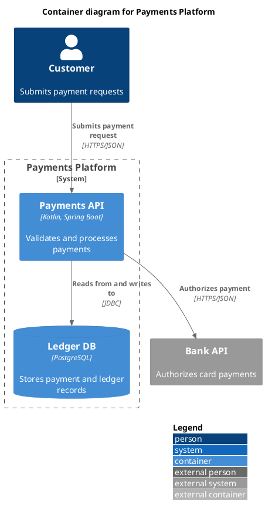
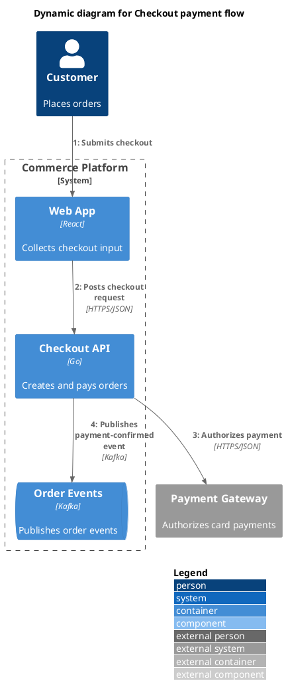
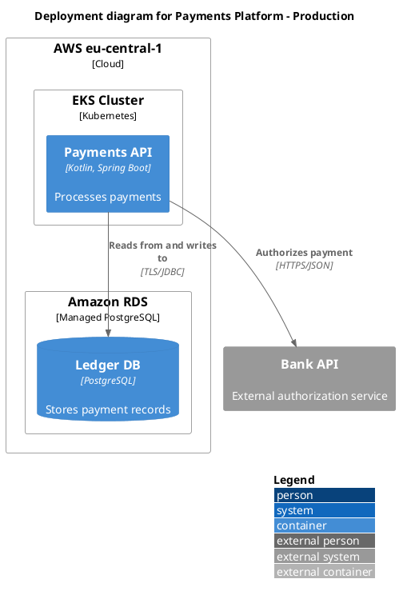

# C4-PlantUML Syntax

Use this file when writing or fixing the PlantUML source itself.

## Include Matrix

Choose the include that matches the diagram type:

- `System Context` or `System Landscape` -> `!include <C4/C4_Context>`
- `Container` -> `!include <C4/C4_Container>`
- `Component` -> `!include <C4/C4_Component>`
- `Dynamic` -> `!include <C4/C4_Dynamic>`
- `Deployment` -> `!include <C4/C4_Deployment>`
- `Sequence` -> `!include <C4/C4_Sequence>` (recognized and explicitly reported as out of scope by this skill)

Fallback to raw GitHub includes only when the standard library include is not suitable. Pin a release tag rather than `master` so the diagram is reproducible:

```plantuml
!include https://raw.githubusercontent.com/plantuml-stdlib/C4-PlantUML/v2.13.0/C4_Container.puml
```

## Minimal File Shape

Use a structure like this for ordinary static diagrams:



Use `LAYOUT_WITH_LEGEND()` for the default legend. Use `SHOW_LEGEND()` instead only when you need explicit legend control or custom tag entries.
Keep one meaningful macro call per line; the validator treats trailing garbage or inline multiple calls after a closed `)` as a parser error.
Legend/layout directives count only as standalone top-level statements. Nested forms such as `Rel(..., SHOW_LEGEND())` are treated as misuse, not as satisfying the legend requirement.
For top-level directives and helpers, the validator also checks their own signatures (allowed named args and positional arity), not only syntax of elements and relationships.

## Core Element Macros

For element macros, `alias` and `label` are required. The validator accepts both positional and fully named element calls when the macro supports those field names explicitly, but it enforces the documented macro-specific named-argument surface.

### Context And Landscape

- `Person(alias, label, ?descr, ?sprite, ?tags, ?link, ?type)`
- `Person_Ext(alias, label, ?descr, ?sprite, ?tags, ?link, ?type)`
- `System(alias, label, ?descr, ?sprite, ?tags, ?link, ?type, ?baseShape)`
- `SystemDb(alias, label, ?descr, ?sprite, ?tags, ?link, ?type)`
- `SystemQueue(alias, label, ?descr, ?sprite, ?tags, ?link, ?type)`
- `System_Ext(alias, label, ?descr, ?sprite, ?tags, ?link, ?type, ?baseShape)`
- `SystemDb_Ext(alias, label, ?descr, ?sprite, ?tags, ?link, ?type)`
- `SystemQueue_Ext(alias, label, ?descr, ?sprite, ?tags, ?link, ?type)`

### Container

- `Container(alias, label, ?techn, ?descr, ?sprite, ?tags, ?link, ?baseShape)`
- `ContainerDb(alias, label, ?techn, ?descr, ?sprite, ?tags, ?link)`
- `ContainerQueue(alias, label, ?techn, ?descr, ?sprite, ?tags, ?link)`
- `Container_Ext(alias, label, ?techn, ?descr, ?sprite, ?tags, ?link, ?baseShape)`
- `ContainerDb_Ext(alias, label, ?techn, ?descr, ?sprite, ?tags, ?link)`
- `ContainerQueue_Ext(alias, label, ?techn, ?descr, ?sprite, ?tags, ?link)`

### Component

- `Component(alias, label, ?techn, ?descr, ?sprite, ?tags, ?link, ?baseShape)`
- `ComponentDb(alias, label, ?techn, ?descr, ?sprite, ?tags, ?link)`
- `ComponentQueue(alias, label, ?techn, ?descr, ?sprite, ?tags, ?link)`
- `Component_Ext(alias, label, ?techn, ?descr, ?sprite, ?tags, ?link, ?baseShape)`
- `ComponentDb_Ext(alias, label, ?techn, ?descr, ?sprite, ?tags, ?link)`
- `ComponentQueue_Ext(alias, label, ?techn, ?descr, ?sprite, ?tags, ?link)`

### Boundaries

- `Boundary(alias, label, ?type, ?tags, ?link, ?descr)`
- `Enterprise_Boundary(alias, label, ?tags, ?link, ?descr)`
- `System_Boundary(alias, label, ?tags, ?link, ?descr)`
- `Container_Boundary(alias, label, ?tags, ?link, ?descr)`

### Deployment

- `Deployment_Node(alias, label, ?type, ?descr, ?sprite, ?tags, ?link)`
- `Deployment_Node_L(alias, label, ?type, ?descr, ?sprite, ?tags, ?link)`
- `Deployment_Node_R(alias, label, ?type, ?descr, ?sprite, ?tags, ?link)`
- `Node(alias, label, ?type, ?descr, ?sprite, ?tags, ?link)`
- `Node_L(alias, label, ?type, ?descr, ?sprite, ?tags, ?link)`
- `Node_R(alias, label, ?type, ?descr, ?sprite, ?tags, ?link)`

## Relationship Macros

Use these for most diagrams:

- `Rel(from, to, label, ?techn, ?descr, ?sprite, ?tags, ?link)`
- `BiRel(from, to, label, ?techn, ?descr, ?sprite, ?tags, ?link)`

Use directional variants only to improve layout, not to change meaning:

- `Rel_U`, `Rel_Up`
- `Rel_D`, `Rel_Down`
- `Rel_L`, `Rel_Left`
- `Rel_R`, `Rel_Right`
- `Rel_Back`
- `Rel_Back_Neighbor`
- `Rel_Neighbor`
- `BiRel_U`, `BiRel_Up`
- `BiRel_D`, `BiRel_Down`
- `BiRel_L`, `BiRel_Left`
- `BiRel_R`, `BiRel_Right`
- `BiRel_Neighbor`

For dynamic diagrams, use `Rel(...)` with an explicit `$index` when sequence order matters:

```plantuml
Rel(web, api, "Posts checkout request", "HTTPS/JSON", $index=2)
Rel(api, gateway, "Authorizes payment", "HTTPS/JSON", $index=3)
```

The supported dynamic form is:

- `Rel($from, $to, $label, $techn="", $descr="", $sprite="", $tags="", $link="", $index="")`

Prefer named arguments for `$index` and `$tags` to avoid positional mistakes.
Do not put spaces before `=` in named arguments such as `$techn=` or `$tags=`; the validator treats that as an error-prone form.

Upstream dynamic numbering helpers are also valid in `C4_Dynamic` and should be treated as part of the supported surface:

- standalone statement helpers: `setIndex($new_index)`, `increment($offset=1)`
- relationship `index=` helper functions: `Index()`, `SetIndex($new_index)`, `LastIndex()`

Use these only in dynamic diagrams. The built-in validator treats them as dynamic-only helpers and counts them as indexing evidence only in these contexts:

- `setIndex(...)` or `increment(...)` as standalone top-level statements
- `Index()`, `SetIndex(...)`, or `LastIndex()` inside relationship `$index=...`
- legacy `RelIndex*` calls

Quoted text such as `"increment() helper"` or `"LastIndex()"` inside labels does not count as helper usage. Helper calls nested in the wrong place, such as `$techn=Index()` or `Rel(..., $techn=setIndex(1))`, are explicit errors and do not suppress the `dynamic diagram has no indexed relationships` warning.

Legacy `RelIndex*` helpers are still supported upstream, but they are obsolete and should only be used for compatibility:

- `RelIndex($e_index, $from, $to, $label, $techn="", $descr="", $sprite="", $tags="", $link="")`
- `RelIndex_Back`, `RelIndex_Back_Neighbor`, `RelIndex_D`, `RelIndex_Down`, `RelIndex_U`, `RelIndex_Up`, `RelIndex_L`, `RelIndex_Left`, `RelIndex_R`, `RelIndex_Right`, `RelIndex_Neighbor`

`C4_Sequence.puml` uses a different relationship API that includes `$rel`; this skill does not validate sequence diagrams and should treat that surface as out of scope.

## Support Matrix

This skill currently supports and validates:

- `System Context`
- `System Landscape`
- `Container`
- `Component`
- `Dynamic`
- `Deployment`

This skill does not currently validate `C4_Sequence.puml` and should not treat sequence-style guidance as part of the supported surface.

## Dynamic Diagram Pattern



## Deployment Diagram Pattern



## Tags, Legend, And Styling

- `AddElementTag(...)` defines element styles and legend entries.
- `AddRelTag(...)` defines relationship styles and legend entries.
- `AddBoundaryTag(...)` defines boundary styles and legend entries.
- `UpdateLegendTitle(newTitle)` changes the legend title.
- `SHOW_LEGEND()` supports custom stereotype and tag entries, but it must be the last line in the diagram.
- `LAYOUT_WITH_LEGEND()` is convenient for default legends, but not when you need custom-tag legend entries.
- `SHOW_FLOATING_LEGEND()` is available when the legend placement must be explicit.
- Trailing `{` is valid only after block-opening macros such as boundaries and deployment nodes, not after normal elements or relationships.

The validator explicitly recognizes additional official C4 global macros as known passthrough (for example `LEGEND`, `Lay_*`, `LAYOUT_AS_SKETCH`, `SET_SKETCH_STYLE`, `HIDE_STEREOTYPE`, person sprite toggles, style/property helpers). They are tolerated and still receive generic parser checks such as trailing-content validation.

## Common Mistakes

- using the wrong `C4_*.puml` include for the chosen diagram type
- mixing context, container, and component detail in one diagram
- omitting technology on containers or components
- keeping relationship labels generic when the action is known
- using `SHOW_LEGEND()` before the last line
- hiding external systems inside an internal boundary
- decomposing multiple containers inside one component diagram
- turning a dynamic diagram into a full process model with too many branches

## Validation

Run the built-in validator before delivery:

```bash
python3 scripts/validate_c4_plantuml.py path/to/diagram.puml
```

If `plantuml` is installed, add the external syntax/render check:

```bash
python3 scripts/validate_c4_plantuml.py path/to/diagram.puml --plantuml on
```

The validator is an opinionated house-style lint plus optional external syntax check. By default it enforces team policy such as title and legend presence; these are not upstream parser requirements and can be disabled with flags when needed.
When the binary is available in CI or a release pipeline, treat `plantuml -checkonly` as a required gate rather than an optional convenience check.

The validator checks:

- matching C4 include and diagram level
- UTF-8 BOM normalization on input before block extraction
- title presence as a house-style requirement
- legend presence as a house-style requirement
- `SHOW_LEGEND()` placement
- legend/layout directives only as standalone top-level macro calls
- missing technology on containers/components
- missing required `label` on elements
- missing or generic relationship labels
- unknown relationship aliases
- boundary or deployment-node aliases used as relationship endpoints
- dynamic helper macros used outside `C4_Dynamic`
- helper-driven dynamic numbering only from valid contexts such as standalone `setIndex(...)` / `increment(...)`, relationship `$index=...`, and legacy `RelIndex*`
- dynamic helper detection based on real calls outside quoted strings and with argument-context checks
- `RelIndex*` compatibility in dynamic diagrams
- dynamic-only relationship APIs used outside `C4_Dynamic`
- sequence-style `$rel` used in non-sequence diagrams
- explicit `C4_Sequence.puml` out-of-scope diagnostics
- sequence-only macro diagnostics such as `SHOW_INDEX`, `SHOW_FOOT_BOXES`, `SHOW_ELEMENT_DESCRIPTIONS`, and `Boundary_End`
- typoed top-level element/relationship macros with suggestion-based matching, while unrelated custom macros stay tolerated
- unsupported named arguments on validated macros, including top-level directives/helpers
- spaces before `=` in named arguments
- trailing garbage after a closed macro call
- trailing `{` after non-structural macros
- extra closing `)` and unclosed `{}` blocks
- `@startuml` / `@enduml` block extraction only outside block comments and multiline `title`
- unterminated `title ... end title`, block comments, or multiline macro calls
- common C4 level-mixing mistakes

Smoke-test the validator and fixtures with:

```bash
python3 scripts/test_validate_c4_plantuml.py
```

When packaging the skill into an archive, keep the distribution clean by excluding `__pycache__`, `.pyc`, `._*`, and `__MACOSX` sidecar artifacts.
